# CSC4005 Assignment4-Report

Student ID: 119010114  

Student Name: Huang Yingyi


## **How to compile & execute?**

### File Tree

​	The project is modified on the template provided on BB.

There are three items in the submitted file: **src** folder, **report**.pdf, and result **video**.

**Under the src directory:**

```shell
.
├── cuda
│   ├── CMakeLists.txt
│   ├── imgui
│   ├── include
│   │   ├── graphic
│   │   └── hdist
│   ├── move.sh
│   └── src
│       ├── graphic.cpp
│       ├── hdist.cu
│       └── main.cpp
├── hybrid
│   ├── CMakeLists.txt
│   ├── imgui
│   ├── include
│   │   ├── graphic
│   │   └── hdist
│   ├── move.sh
│   └── src
│       ├── graphic.cpp
│       └── main.cpp
├── mpi
│   ├── CMakeLists.txt
│   ├── imgui
│   ├── include
│   │   ├── graphic
│   │   └── hdist
│   ├── move.sh
│   └── src
│       ├── graphic.cpp
│       └── main.cpp
├── omp
│   ├── CMakeLists.txt
│   ├── imgui
│   ├── include
│   │   ├── graphic
│   │   └── hdist
│   └── src
│       ├── graphic.cpp
│       └── main.cpp
├── pthread
│   ├── CMakeLists.txt
│   ├── imgui
│   ├── include
│   │   ├── graphic
│   │   └── hdist
│   ├── move.sh
│   └── src
│       ├── graphic.cpp
│       └── main.cpp
└── sequential
    ├── CMakeLists.txt
    ├── imgui
    ├── include
    │   ├── graphic
    │   └── hdist
    └── src
        ├── graphic.cpp
        └── main.cpp

61 directories, 96 files
```

**Under each of the sub-directory {sequential, MPI, Pthread, cuda, openmp, hybrid}:**

The code is stored in **src** directory.

**sequential:** the provided sequential version of code.

**MPI:** the MPI implementation.

**Pthread**: pthread implementation.

**CUDA**: cuda implementation.

**openmp**: openmp implementation.

**hybrid**: MPI + OPENMP implementation.


### Execution Steps (Some example test commands included)

**NOTICE: ** you should specify the iteration limit number.

##### MPI

```shell
mkdir build && cd build
cmake .. -DCMAKE_BUILD_TYPE=Release
cmake --build . -j12

-----compliation-end-------
# arugument lists: testmpi <SIZE> <Iteration_Limit> <GRAPH:0/1> <ALGO:0/1>
# to have GUI display:
mpirun-gui testmpi 200 1000 1 1 # 200*200, 1000 iterations, GUI display, Sor
# to disable GUI display
mpirun testmpi 200 1000 0 0 # 200*200, 1000 iterations, no GUI display, Jacobi
```

##### CUDA

```shell
source scl_source enable devtoolset-10
CC=gcc CXX=g++ cmake ..
make -j12

-----compliation-end-------
# argument list: testCUDA <SIZE> <Iteration_Limit> <GRAPH:0/1> <BLOCK_SIZE> <ALGO>
srun testCUDA <SIZE> <Iteration_Limit> <GRAPH:0/1> <BLOCK_SIZE> <ALGO>
export XAUTHORITY=.Xauthority
srun --export=DISPLAY,XAUTHORITY ./testCUDA 200 5 1 125 0 # GUI display

# submit to sbatch
#!/bin/bash
#SBATCH --account=csc4005
#SBATCH --partition=debug
#SBATCH --qos=normal
#SBATCH --ntasks=1
#SBATCH -t 10
echo "mainmode: " && /bin/hostname
echo "cuda test 1000 data with 1000 threads per block"
srun testCUDA 1000 5 0 1000 0
echo "cuda test 1000 data with 500 threads per block"
srun testCUDA 1000 5 0 500 0
echo "cuda test 1000 data with 250 threads per block"
srun testCUDA 1000 5 0 250 0
echo "cuda test 1000 data with 125 threads per block"
srun testCUDA 1000 5 0 125 0

```

##### Pthread

```shell
mkdir build && cd build
cmake .. -DCMAKE_BUILD_TYPE=Release
cmake --build . -j12

-----compliation-end-------
# argument list: testp <SIZE> <Iteration_Limit> <GRAPH:0/1> <ALGO> <THREAD_NUM>
./testp 200 100 1 1 16 # GUI display, Sor algorithm, 16 threads
./testp 200 100 0 0 16 # NO GUI display, Jacobi algorithm, 16 threads
```

##### Openmp

```shell
mkdir build && cd build
cmake .. -DCMAKE_BUILD_TYPE=Release
cmake --build . -j12

-----compliation-end-------
# argument list: testomp <SIZE> <Iteration_Limit> <GRAPH:0/1> <ALGO> <THREAD_NUM>
./testomp 200 100 1 1 16 # GUI display, 100 iterations, Sor algorithm, 16 threads
./testomp 200 100 0 0 16 # NO GUI display, 100 iterations, Jacobi algorithm, 16 threads
```

##### Hybrid for Bonus

```shell
mkdir build && cd build
cmake .. -DCMAKE_BUILD_TYPE=Release
cmake --build . -j12

-----compliation-end-------
# argumennt list: testhb <SIZE> <Iteration_Limit> <GRAPH:0/1> <ALGO> <THREAD>
# with GUI
salloc -N 2 --ntasks-per-node=1 -c 4
mpirun-gui testhb 600 10 1 0 4 # 600*600, 10 iterations, no GUI, Jacobi, 4 threads

# submit to sbatch
# without GUI
#!/bin/bash
#SBATCH --account=csc4005
#SBATCH --partition=debug
#SBATCH --qos=normal
#SBATCH --output=hybrid-600-4-32.out
#SBATCH --ntasks=4
#SBATCH --cpus-per-task=32
#SBATCH -t 5
echo "mainmode: " && /bin/hostname
echo "test data=600, test rank = 4, thread = 32"
mpirun testhb 600 10 0 0 32 # 600*600, 10 iterations, no GUI, Jacobi, 32 threads
```


## 1. Introduction

​		In this project we implemented **five versions** of heat distribution simulation program, using **MPI, Pthread, CUDA, openMP, and MPI+openMP**.

​		In the $2nd$​​​​ part, we are going to talk about the **general idea** of the computation, and introduce some **details**. For each version of implementation, we provide a flow chart, which is consistent to the general computation idea.

​		In the $3rd$, we included some running results by comparison  tests to validate the function of the $5$ implememtations.

​		In the $4th$​​​​​ part, we are going to **do some experiments** on the five versions of implementation. The **speed and speedup** recodes are used for performance analysis and comparison.

​		In the $5th$​ part, we make a conclusion for this assignment.


## 2. Method

### Computation Idea

****

​		In this heat distribution simulation program, we are going to simulate the heat distribution under the condition that (1) the temperatures of the 4 walls are fixed during the computation and (2) the specfied source temperature is fixed. And there are $2$ algorithms for the temperature computation of other points. The first is the Jacobi algorithm, which takes the average of the surrounding $4$​ points' temperatures. The second is the SOR (Successive over-relaxation) algorithms. This algorithm takes the odd or even terms to calculate each computation turn and can converges in a faster speed than the Jacobi algorithm.


### How to structure the workload

****

​		There is a pool of points, each of which has a temperature value and needs calculation each computing turn. We view the pool as our total workload, and send parts of this pool as individual tasks to different workers to distribute workload in parallel. 


### How to distribute workload

****

#### CUDA

​		In CUDA implementation, we let each thread cross a stripe to fetch a slot to commutate.  Each CUDA thread can get the equal number of slots to deal with. The stride is very useful when the total number of points exceed the assigned grids and blocks.

```cpp
int index = blockIdx.x * blockDim.x + threadIdx.x;
    int stride = blockDim.x * gridDim.x;

    // zero accleration
    for (size_t i = index; i < room_size; i+=stride) {
    	do some job
    }
```


#### Openmp

​	In the open MP implementation, we use the *parallel for* pragma to let the compiler use the default scheduler method. Notice that the inner loop has its counting variable **j** declared and defined in the for statement, we do not need to make it as private.

```cpp
#pragma omp parallel for num_threads(THREAD) 
for (size_t i = 0; i < state.room_size; ++i) {
                    for (size_t j = 0; j < state.room_size; ++j) {
                        auto temp = update_single(i, j, grid, state);
                        grid[{alt, i, j}] = temp;
                    }
                }
```


#### MPI, Pthread, Bonus

​		In these $4$​​​ implementations, expect for the openmp implementation, we maintain a **displs** array and a **scounts** array, recording the responsible part for each worker (start index and length). The two arrays are computed in this way. And for the hybrid version in bonus task, we add a pragma **parallel for** to the local for loop of all ranks.

```cpp
struct Workload
{
    int localoffset = 0;
    int localsize = 0;
};

Workload workload_distributor(int *displs, int *scounts, int rank, int bodies, int wsize)
{
    Workload mywork;
    int offset = 0, cur_rank = 0, worker_proc = 0, remain = 0, localoffset = 0;
    // [1] Each proc get jobs to do
    if (bodies >= wsize * MIN_PER_PROC)
    {
        offset = 0;
        for (cur_rank = 0; cur_rank < wsize; ++cur_rank)
        {
            displs[cur_rank] = offset;
            if (cur_rank == rank)
            {
                mywork.localoffset = localoffset;
                mywork.localsize = std::ceil(((float)bodies - cur_rank) / wsize);
            }
            localoffset += std::ceil(((float)bodies - cur_rank) / wsize);
            scounts[cur_rank] = std::ceil(((float)bodies - cur_rank) / wsize) * bodies;
            offset += scounts[cur_rank];
        }
    }
    // [2] Some proc has no job to do
    else
    {
        offset = 0;
        worker_proc = std::ceil((float)bodies / MIN_PER_PROC);
        remain = bodies % MIN_PER_PROC;
        for (cur_rank = 0; cur_rank < worker_proc - 1; ++cur_rank)
        {
            displs[cur_rank] = offset;
            if (cur_rank == rank)
            {
                mywork.localoffset = localoffset;
                mywork.localsize = MIN_PER_PROC;
            }
            localoffset += MIN_PER_PROC;
            scounts[cur_rank] = MIN_PER_PROC * bodies;
            offset += MIN_PER_PROC * bodies;
        }
        displs[cur_rank] = offset;
        if (cur_rank == rank) {
            mywork.localoffset = localoffset;
            mywork.localsize = remain == 0 ? MIN_PER_PROC : remain;
        }
        localoffset += (remain == 0 ? MIN_PER_PROC : remain);
        scounts[cur_rank] = remain == 0 ? MIN_PER_PROC * bodies : remain * bodies;
        offset += scounts[cur_rank];
        cur_rank++;
        for (; cur_rank < wsize; ++cur_rank)
        {
            if (cur_rank == rank) {
                mywork.localoffset = localoffset;
                mywork.localsize = 0;
            }
            displs[cur_rank] = offset;
            scounts[cur_rank] = 0;
        }
    }
    return mywork;
}
```

​	


### Who should receive the input data and display GUI

****

​		The root process / thread receives all inputs and display the graph.


###  **Flow Chart**

****

​	The grid, which represents the temperature distribution with 2 temperature buffers (data0, data1), is used to compute and display GUI. The data0 and data1, one of which acts as the storage of the current temperature, and the other acts as the computing buffer in turn, should be used or updated in each iteration.

```cpp
struct Grid {
        std::vector<double> data0, data1;
        size_t current_buffer = 0;
        size_t length;
    ...
}
```


#### MPI




#### Pthread


#### CUDA


#### openMP


#### Bonus


## 3. Experiments and Analysis

#### Functionality Validation

​	To validate the correct functionality of the $5$​​​ versions of parallel implementations, we use compare the parallel computation results, with the results  computed by the provided sequential implementation. If the results are not identical, we will see some outputs from terminal. 

​	The comparison is done by the following codes.

```cpp
#ifdef debug
                    int k_turn1 = 0;
                    Workload mywork1;
                    mywork1.localoffset = 0;
                    mywork1.localsize = current_state.room_size;
                    if (current_state.algo == hdist::Algorithm::Jacobi)
                        hdist::calculate(current_state, grid1, mywork1, k_turn1);
                    else if (current_state.algo == hdist::Algorithm::Sor)
                    {
                        hdist::calculate(current_state, grid1, mywork1, k_turn1); // calculate entry of standard
                        k_turn1 = !k_turn1;
                        hdist::calculate(current_state, grid1, mywork1, k_turn1);
                        k_turn1 = !k_turn1;
                    }
                    for (int i = 0; i < current_state.room_size; ++i)
                    {
                        for (int j = 0; j < current_state.room_size; ++j)
                        {
                            double ans = grid1[{i, j}];
                            double myres = grid[{i, j}];
                            if (ans != myres)
                                std::cout << "ans: " << ans << " myres: " << myres << std::endl;
                        }
                    }
#endif
```

​	All the $5$​ versions passed the comparison tests, and their functionality should be correct.


#### Experiment 1: MPI

Here are some of the results of speed and speedup.

##### *The **Speed** with Different Data Size and Number of Cores (Points / Second)*

****

| datasize\rank | 1        | 2        | 4        | 8        | 16       | 32       | 64       | 96       | 128      |
| ------------- | -------- | -------- | -------- | -------- | -------- | -------- | -------- | -------- | -------- |
| 200           | 2.52E+08 | 8.53E+07 | 1.49E+08 | 7.41E+07 | 4.40E+07 | 3.17E+07 | 8.98E+06 | 5.57E+06 | 5.25E+06 |
| 400           | 2.27E+08 | 1.48E+08 | 1.50E+08 | 9.75E+07 | 6.55E+07 | 5.27E+07 | 2.29E+07 | 1.50E+07 | 1.84E+06 |
| 600           | 2.24E+08 | 1.45E+08 | 1.45E+08 | 1.31E+08 | 7.11E+07 | 3.87E+07 | 8.86E+06 | 1.68E+07 | 1.60E+07 |
| 800           | 2.34E+08 | 1.53E+08 | 1.49E+08 | 1.19E+08 | 9.28E+07 | 6.25E+07 | 3.92E+07 | 2.81E+07 | 2.38E+07 |
| 1000          | 2.34E+08 | 1.38E+08 | 1.33E+08 | 1.11E+08 | 8.22E+07 | 6.15E+07 | 4.18E+07 | 2.15E+07 | 2.70E+07 |

##### *The **Speedup** with Different Data Size*

****

| datasize\rank | 1    | 2    | 4    | 8    | 16   | 32   | 64   | 96   | 128  |
| ------------- | ---- | ---- | ---- | ---- | ---- | ---- | ---- | ---- | ---- |
| 200           | 1.00 | 0.34 | 0.59 | 0.29 | 0.17 | 0.13 | 0.04 | 0.02 | 0.02 |
| 400           | 1.00 | 0.65 | 0.66 | 0.43 | 0.29 | 0.23 | 0.10 | 0.07 | 0.01 |
| 600           | 1.00 | 0.65 | 0.65 | 0.58 | 0.32 | 0.17 | 0.04 | 0.07 | 0.07 |
| 800           | 1.00 | 0.65 | 0.64 | 0.51 | 0.40 | 0.27 | 0.17 | 0.12 | 0.10 |
| 1000          | 1.00 | 0.59 | 0.57 | 0.48 | 0.35 | 0.26 | 0.18 | 0.09 | 0.12 |


##### Analysis

****

​		The speedup is not good even we used many processors (ranks) to perform the computations. The possible reason is that we spent too much time on the communication among processors (broadcast twice and gather twice each iteration). And the network latency during the test may be also too high. But we can still see some speedup when our configurations changed from $2$ processors to $4$ processors.  


#### Experiment 2: Pthread

##### *The **Speed** with Different Data Size and Number of Cores (Points / Second)*

****

| datasize\thread | 1        | 2        | 4        | 8        | 16       | 32       | 64       | 96       | 128      |
| --------------- | -------- | -------- | -------- | -------- | -------- | -------- | -------- | -------- | -------- |
| 200             | 2.42E+08 | 2.75E+08 | 2.36E+08 | 1.28E+08 | 7.70E+07 | 3.92E+07 | 1.52E+07 | 1.32E+07 | 8.12E+06 |
| 400             | 3.40E+08 | 5.51E+08 | 6.37E+08 | 4.74E+08 | 2.91E+08 | 1.53E+08 | 7.71E+07 | 5.41E+07 | 4.21E+07 |
| 600             | 3.93E+08 | 7.01E+08 | 9.49E+08 | 1.05E+09 | 6.01E+08 | 3.27E+08 | 1.78E+08 | 1.14E+08 | 8.51E+07 |
| 800             | 4.27E+08 | 7.60E+08 | 1.18E+09 | 1.46E+09 | 1.05E+09 | 5.92E+08 | 3.37E+08 | 2.04E+08 | 1.25E+08 |
| 1000            | 4.16E+08 | 7.82E+08 | 1.41E+09 | 1.82E+09 | 1.63E+09 | 1.02E+09 | 4.84E+08 | 3.18E+08 | 2.35E+08 |

##### *The **Speedup** with Different Data Size*

****

| datasize\thread | 1    | 2    | 4    | 8    | 16   | 32   | 64   | 96   | 128  |
| --------------- | ---- | ---- | ---- | ---- | ---- | ---- | ---- | ---- | ---- |
| 200             | 1.00 | 1.14 | 0.98 | 0.53 | 0.32 | 0.16 | 0.06 | 0.05 | 0.03 |
| 400             | 1.00 | 1.62 | 1.88 | 1.39 | 0.86 | 0.45 | 0.23 | 0.16 | 0.12 |
| 600             | 1.00 | 1.78 | 2.41 | 2.68 | 1.53 | 0.83 | 0.45 | 0.29 | 0.22 |
| 800             | 1.00 | 1.78 | 2.77 | 3.43 | 2.47 | 1.39 | 0.79 | 0.48 | 0.29 |
| 1000            | 1.00 | 1.88 | 3.40 | 4.39 | 3.91 | 2.46 | 1.16 | 0.76 | 0.57 |


##### Analysis

****

​		The speedup is the best when we choose the configurations as $8$ processors to perform in $8$ threads. When the thread number is less than $8$, the speedup is good and increasing with the increasing number of processors. However, when the thread number is greater than $8$, the speedup decreases with the increasing number of processors (threads are of the number shown in graph, but the number of processors each node is $32$​ in maximum). The possible reason is that the data size is too small. The overhead to create threads overrides the speedup brought by parallel computation. This can be proved by the our test results, which shows that when the data size is big, the speedup brought by parallelism is the highest.


#### Experiment 3: CUDA

##### *The **Speed** with Different Data Size and Number of Cores (Points / Second)*

****

| blocksize\data | 200      | 400      | 600      | 800      | 1000     |
| -------------- | -------- | -------- | -------- | -------- | -------- |
| 200            | 1.11E+08 | 1.05E+08 | 1.22E+08 | 1.40E+08 | 1.22E+08 |
| 100            | 1.33E+08 | 1.44E+08 | 1.68E+08 | 1.61E+08 | 1.75E+08 |
| 50             | 1.41E+08 | 1.72E+08 | 2.01E+08 | 2.02E+08 | 2.17E+08 |
| 25             | 1.42E+08 | 1.80E+08 | 2.11E+08 | 2.25E+08 | 2.37E+08 |

($DATA = BLOCK \space size \times BLOCK \space NUM$​​)


##### Analysis

****

​	In this CUDA implementation, we choose to set the number of threads of each block and let the program adjusts the number of blocks. And the program ensures that each thread take one unit of workload if possible. 

​	The results show that, for a fixed number of threads in total, when the local thread number is smaller, the speedup is better. The possible reason is that the block shared memory is limited. When the local thread number is high, the IO cost becomes high. But when the local thread is small, the memory swapping in each block is not so busy, which provides higher speedup. 


#### Experiment 4: OpenMP

##### *The **Speed** with Different Data Size and Number of Cores (Points / Second)*

****

| datasize\thread | 1        | 2        | 4        | 8        | 16       | 32       | 64       | 96       | 128      |
| --------------- | -------- | -------- | -------- | -------- | -------- | -------- | -------- | -------- | -------- |
| 200             | 1.78E+08 | 1.89E+08 | 1.67E+08 | 1.20E+08 | 7.06E+07 | 2.30E+07 | 1.69E+07 | 3.03E+07 | 5.91E+06 |
| 400             | 3.96E+08 | 5.34E+08 | 5.52E+08 | 3.86E+08 | 3.18E+08 | 9.62E+07 | 1.05E+08 | 2.24E+07 | 1.55E+07 |
| 600             | 5.55E+08 | 8.39E+08 | 9.86E+08 | 4.95E+08 | 4.73E+08 | 3.76E+08 | 5.44E+07 | 5.95E+07 | 3.55E+07 |
| 800             | 6.57E+08 | 1.07E+09 | 1.27E+09 | 1.62E+09 | 9.48E+08 | 5.00E+08 | 1.56E+08 | 5.82E+07 | 8.05E+07 |
| 1000            | 6.91E+08 | 1.21E+09 | 1.78E+09 | 1.77E+09 | 1.47E+09 | 5.72E+08 | 3.93E+08 | 1.14E+08 | 7.76E+07 |

##### *The **Speedup** with Different Data Size*

****

| datasize\thread | 1    | 2    | 4    | 8    | 16   | 32   | 64   | 96   | 128  |
| --------------- | ---- | ---- | ---- | ---- | ---- | ---- | ---- | ---- | ---- |
| 200             | 1.00 | 1.06 | 0.94 | 0.68 | 0.40 | 0.13 | 0.10 | 0.17 | 0.03 |
| 400             | 1.00 | 1.35 | 1.39 | 0.98 | 0.80 | 0.24 | 0.27 | 0.06 | 0.04 |
| 600             | 1.00 | 1.51 | 1.78 | 0.89 | 0.85 | 0.68 | 0.10 | 0.11 | 0.06 |
| 800             | 1.00 | 1.63 | 1.93 | 2.47 | 1.44 | 0.76 | 0.24 | 0.09 | 0.12 |
| 1000            | 1.00 | 1.74 | 2.57 | 2.56 | 2.13 | 0.83 | 0.57 | 0.16 | 0.11 |


##### Analysis

****

​	The speedup is the best when we choose the configurations as $4$​ or $8$​ processors to perform in $4 \space or \space 8$​ threads. When the thread number is less than this, the speedup is good and increasing with the increasing number of processors. However, when the thread number is greater than this, the speedup decreases with the increasing number of processors (threads are of the number shown in graph, but the number of processors each node is $32$​ in maximum). The possible reason is that the data size is too small. The overhead to create threads overrides the speedup brought by parallel computation. This can be proved by the our test results, which shows that when the data size is big, the speedup brought by parallelism is the highest.


#### Experiment 5: OpenMP + mpi

##### The **Speed** with Different Data Size and Number of Cores (Points / Second)

###### data size = 200 (200 * 200)

| thread\rank | 1        | 2        | 4        |
| ----------- | -------- | -------- | -------- |
| 1           | 2.47E+07 | 2.29E+07 | 2.31E+07 |
| 2           | 1.62E+07 | 3.23E+07 | 1.58E+07 |
| 4           | 1.02E+07 | 1.37E+06 | 8145200  |
| 8           | 5.51E+06 | 7423530  | 5720360  |
| 16          | 3.04E+06 | 4364650  | 2318330  |
| 32          | 1.40E+06 | 3577370  | 1092220  |


###### data size = 600 (600 * 600)

| thread\rank | 1        | 2        | 4        |
| ----------- | -------- | -------- | -------- |
| 1           | 1.91E+08 | 1.57E+08 | 9.60E+07 |
| 2           | 9.09E+07 | 9.70E+07 | 6.22E+07 |
| 4           | 7.63E+07 | 6.73E+06 | 5.02E+06 |
| 8           | 3.87E+07 | 5.44E+06 | 4.35E+06 |
| 16          | 1.74E+07 | 2.63E+06 | 1.09E+06 |
| 32          | 9.66E+06 | 1.09E+06 | 8203100  |


###### data size = 1000 (1000 * 1000)

| thread\rank | 1        | 2        | 4        |
| ----------- | -------- | -------- | -------- |
| 1           | 1.54E+08 | 1.16E+08 | 1.34E+08 |
| 2           | 1.80E+08 | 7.47E+07 | 5.08E+07 |
| 4           | 1.10E+08 | 2.82E+07 | 1.41E+07 |
| 8           | 5.24E+07 | 1.35E+07 | 9.71E+06 |
| 16          | 3.20E+07 | 5.16E+06 | 2.99E+06 |
| 32          | 1.66E+07 | 2.46E+06 | 2.24E+06 |


##### Analysis

****

​	In each of the data size configurations (200 * 200, 600 * 600, 1000 * 1000), the speedup is better when the processors are used for a MPI rank, instead of a open MP thread. The possible reason is that the MPI standard guarantees the better locality the open MP standard. The computation speed is slowed down due to higher IO overhead. However, it would be a good choice to add open MP to the MPI implementation if we are going to reduce the memory use, since the memory space for a process is much higher than the memory space of a thread.


#### Comparison Between Pthread & OpenMP


​	When the data size is small (200 - 600), the Pthread implementation is better than the open MP implementation. When the data size is large, the open MP implementation is better than the Pthread implementation. The possible reason is that, the open MP adopts a better scheduler mechanism. With this better scheduler, the scheduling overhead is higher, while the actual computation can be better speeded up. However, when the data size is small, the speedup brought by better scheduler cannot override the overhead of a complicated scheduler.


#### Comparison Between MPI & MPI+OpenMP

​	According to the results we obtained above, the MPI implementation has a better performance than the MPI + open MP implementation. The reason is that MPI implementation provides better locality then open MP. And the communication overhead on each node is greatly reduced by the **memory copy** in MPI, which makes the data sharing on local nodes much faster than shared memory mechanism adopted by open MP.


## 4. Conclusion

​		In this assignment, we have implemented five versions of heat distribution simulation by MPI, CUDA, Open MP, and Pthread. All these implementations work well and our comparison test validated this. The speedup by CUDA is good according to the test results. As for the Pthread and open MP implementation, we performed some experiments and found the Pthread implementation better for small data size while the open MP implementation better for large data size. The reason for that may be the open MP scheduler mechanism. As for the MPI and hybrid implementation (open MP + MPI), the pure MPI version is better. The possible reason is that, MPI guarantees better locality, and its local communication method (memory copy for MPI,  shared memory for open MP) is better.

